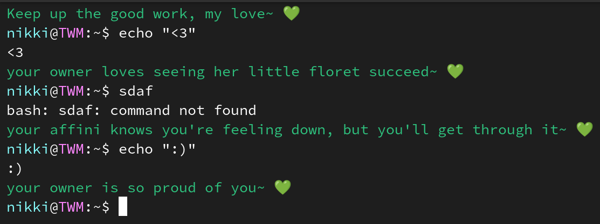

# ilo-Niki/shell-affini

Inspired by [Gankra/cargo-mommy](https://github.com/Gankra/cargo-mommy), [Sudofox/shell-mommy](https://github.com/sudofox/shell-mommy), and [Human Domestication Guide](https://humandomestication.guide/)

This is a shell script that provides an `affini` function which emulates a nurturing and supportive figure. The `affini` function can be used to offer praise and encouraging responses to a sophont's actions, depending on the exit status of the command that is passed to it.

By default, the text will be output in a light pink to stderr. You can change this to a light blue if you find that more encouraging.

</a>


I hope this will serve to improve the efficiency of your workflow and general mental health. Please use responsibly.

## Installation

To use the `affini` function, you can source the `shell-affini.sh` script in your current shell or add it to your `~/.bashrc` file to have it available every time you open a new terminal.

```
. /path/to/shell-affini.sh
```

If you'd like it to always show a message after each command, you can define a custom `PROMPT_COMMAND` like so:

```
export PROMPT_COMMAND="affini \\$\\(exit \$?\\); $PROMPT_COMMAND"
```

## Configuration

The `affini` function has several customizable options that can be set using environment variables:

- `SHELL_AFFINIS_LITTLE`: Sets the affectionate term that `affini` will use to refer to the sophont. The default value is "floret".
- `SHELL_AFFINIS_PRONOUNS`: Sets the pronouns that `affini` will use to refer to itself. The default value is "her".
- `SHELL_AFFINIS_ROLES`: Sets the role that `affini` will have. The default value is "your affini/your owner".
- `SHELL_AFFINIS_COLOR`: Sets the color of the text output by `affini`. The default value is a green color.
- `SHELL_AFFINIS_ONLY_NEGATIVE`: If set to `true`, `affini` will provide encouragement (on non-zero exit status) but not praise. This will keep clutter down if you intend to use `affini` as a `PROMPT_COMMAND`.
- `SHELL_AFFINIS_NEGATIVE_RESPONSES`/`SHELL_AFFINIS_POSITIVE_RESPONSES`: Sets the possible responses that `affini` will use. This should be in the form of a bash array and will override the default responses. Want Samuel L. Jackson to chastise or compliment you? [Now you can!](https://github.com/sudofox/shell-mommy/issues/5#issuecomment-1381029744)

To add multiple possible values, separate them with a forward slash, for example:

```sh
export SHELL_AFFINIS_LITTLE="floret/sophont"
# ...
$ affini ls
README.md  shell-affini.sh
awe, what a good floret~
your affini knew you could do it~ 💚
$ affini ls
README.md  shell-affini.sh
good sophont~
your owner's so proud of you~ 💚
$ affini ls
README.md  shell-affini.sh
your affini thinks her little floret earned a big hug~ 💚
```

## Usage

To use the `affini` function, simply pass a command as an argument and `affini` will provide a supportive response based on the exit status of the command. Depending on the exit status, `affini` will provide a response of praise or encouragement.

```sh
affini ls
# Output: Good floret! your affini's so proud of you! 💚

affini this-command-does-not-exist
# Output: Just a little further, sweetie~ 💚
```

## Example

```
# Set custom affectionate term and pronouns
export SHELL_AFFINIS_LITTLE="kiddo"
export SHELL_AFFINIS_PRONOUNS="them"

# Use the affini function to run a command
affini ls

# Output:
# That's a good kiddo~ 💚
```
